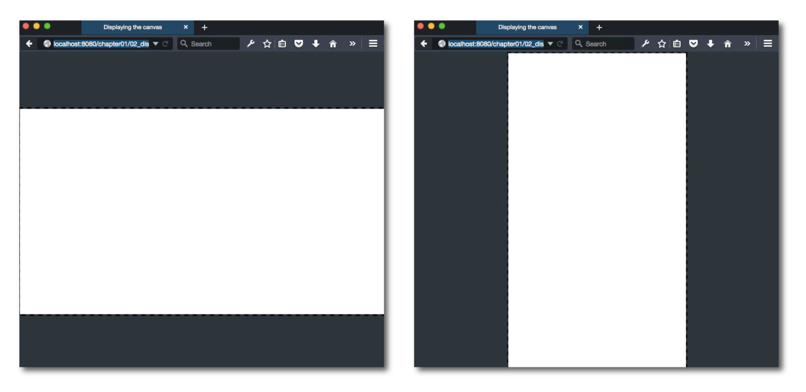

Scale and align a canvas element in the browser
===============================================
Use the function `scaleToWindow` to scale an HTML canvas element to
the maximum size of the browser's window. `scaleToWindow` will also align the canvas for the best vertical or horizontal fit inside the browser window. For example, if you have a canvas that's wider than it is tall, it will be centered vertically inside the browser. If the canvas is taller than it is wide, it will be centered horizontally.



Here's how to use `scaleToWindow`:
```js
scaleToWindow(anyCanvasElement, borderColor);
```
(If you are using [Pixi](https://github.com/GoodBoyDigital/pixi.js/), supply the `renderer.view` as the canvas.)
The optional second argument lets you set the color of the browser's background that borders the canvas. You can supply any RGB, HSLA or Hexadecimal color value, as well as the any HTML color string, like “blue” or “red”. (If you don't supply this optional color, the border will be set to a neutral dark gray: #2C3539.)

The `scaleToWindow` function also returns the `scale` value that the
canvas is scaled to. You can find it like this:
```js
var scale = scaleToWindow(renderer.view);
```
This will give you a number, like 1.98046875, which tells you the
ratio by which the canvas was scaled. This might be an important value
to know if you need to convert browser pixel coordinates to the scaled
pixel values of the canvas. For example, if you have a `pointer`
object which tracks the mouse's position in the browser, you might
need to convert those pixel positions to the scaled canvas coordinates
to find out if the mouse is touching something in the canvas. Some general code like this will do the trick:
```js
pointer.x = pointer.x / scale;
pointer.y = pointer.y / scale;
```
Optionally, you might also want the canvas to rescale itself every
time the size of the browser window is changed. If that’s the case,
call `scaleToWindow` inside a window event listener:
```js
window.addEventListener("resize", function(event){ 
  scaleToWindow(anyCanvasElement);
});
```

